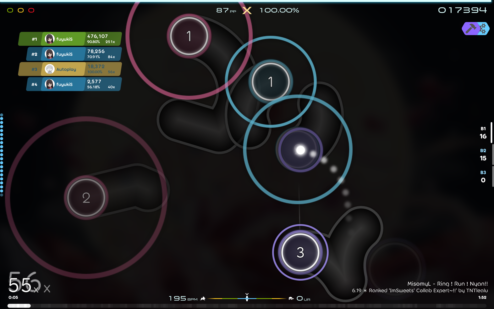
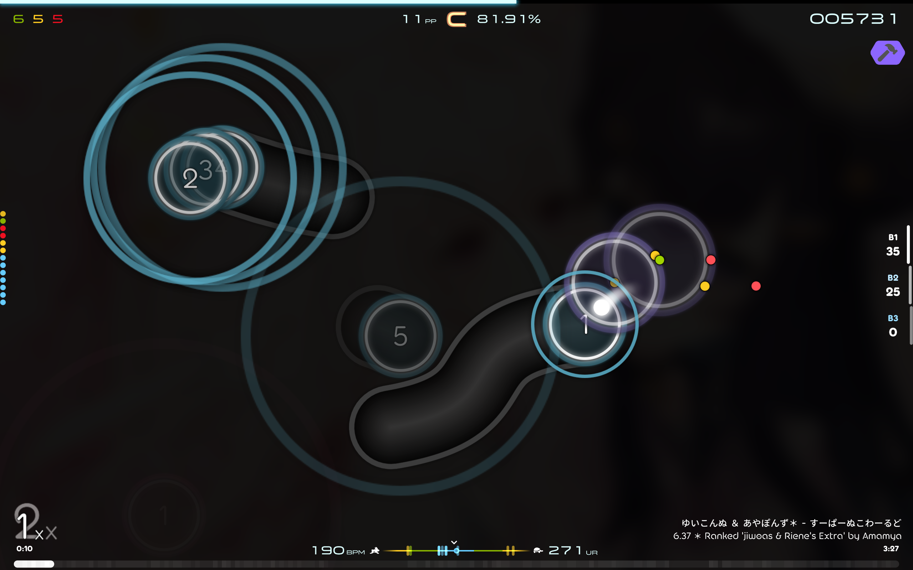
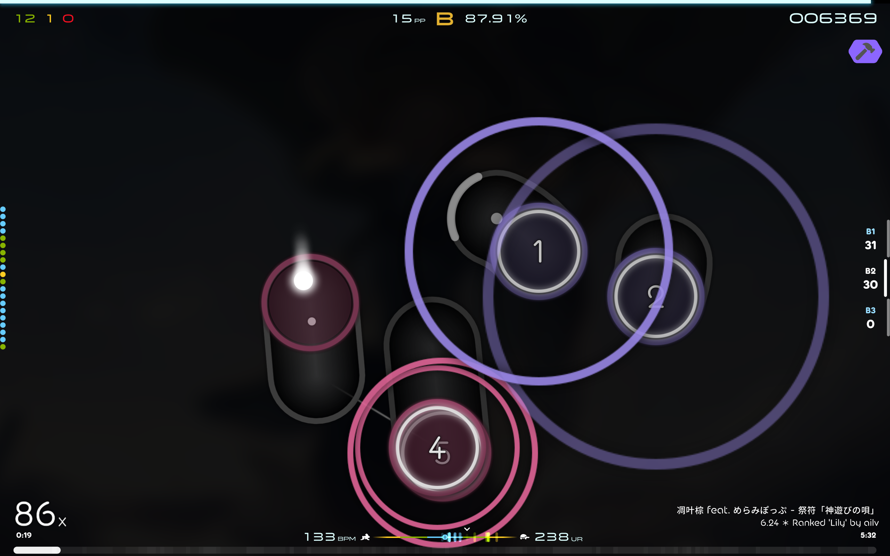
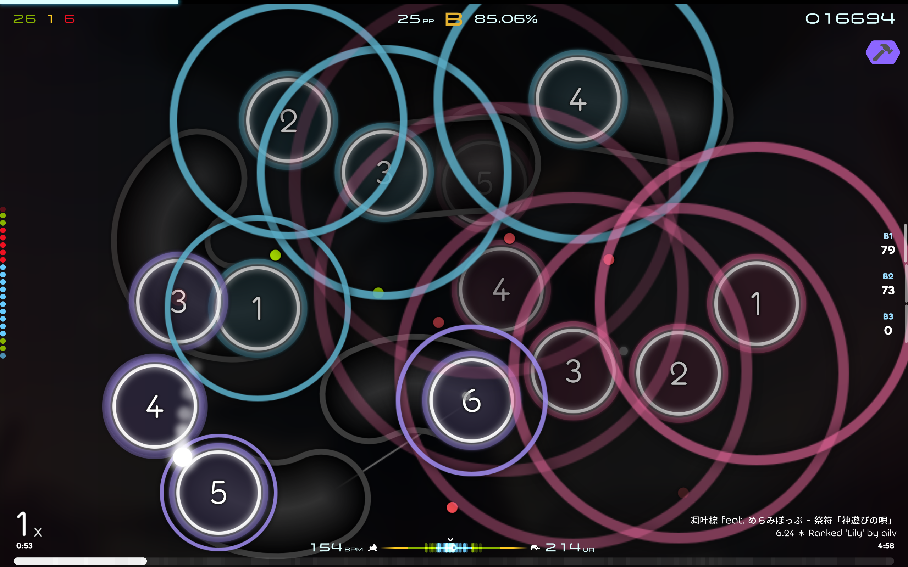
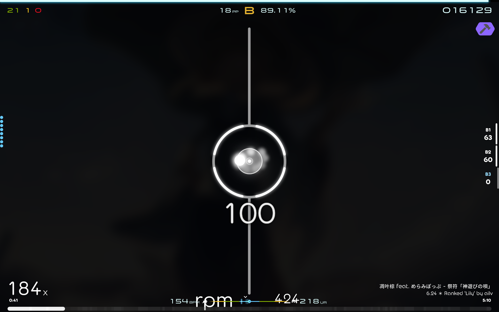
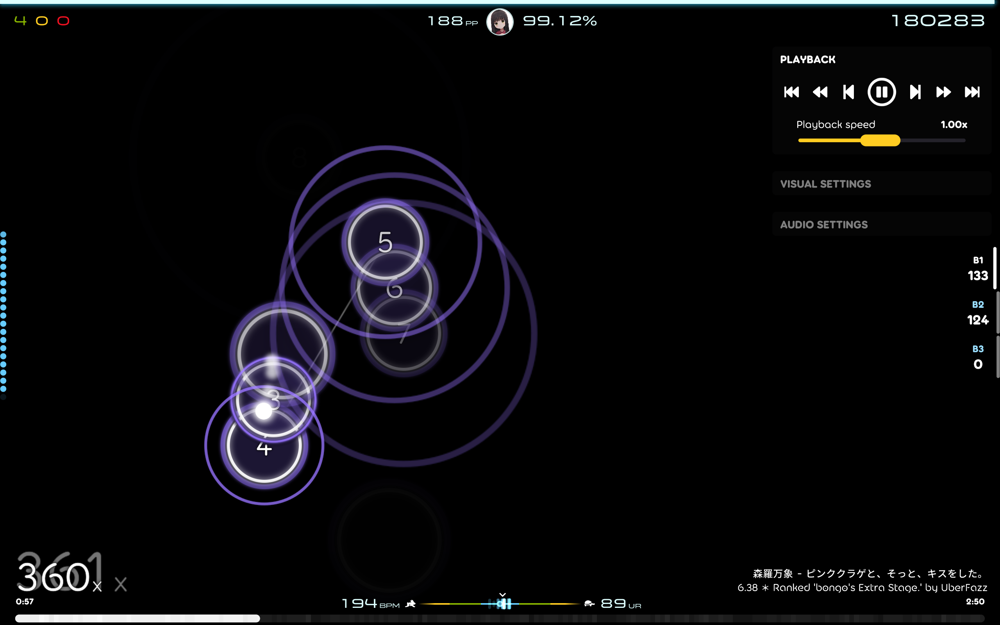
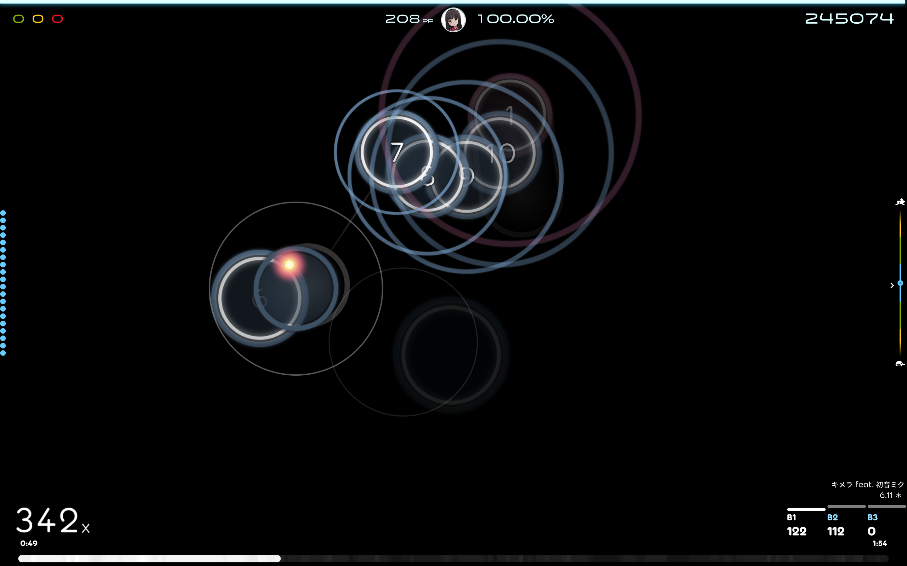
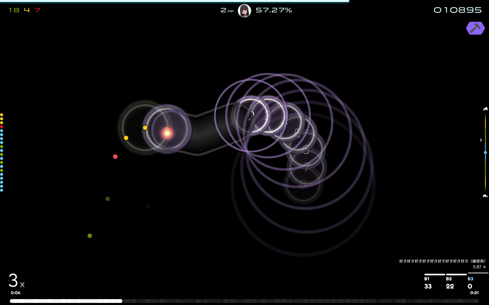
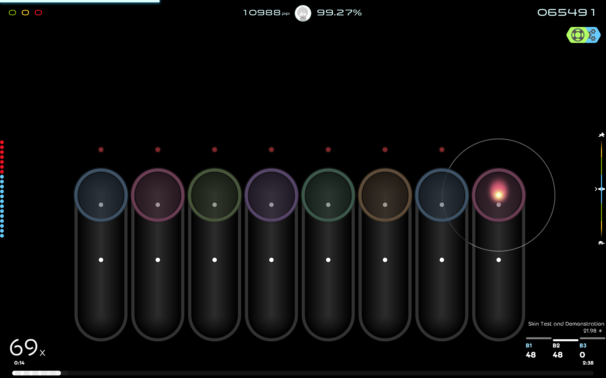
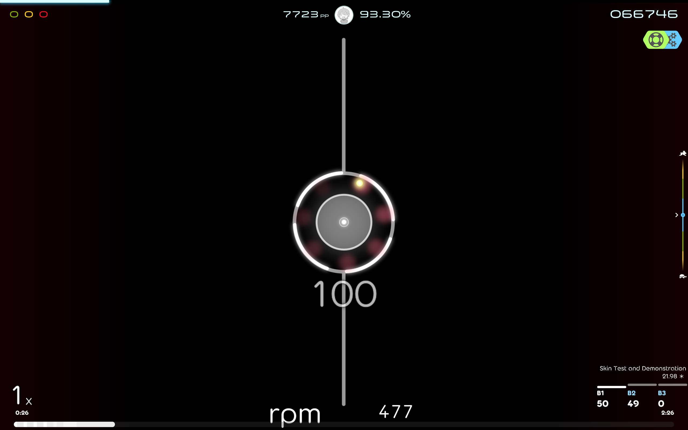

# osu-skin-KaKKeY
KaKKeY is a STD osu!lazer skin originated by fuyukiS' uncompleted rhythm game project KaKKeY.

Hitsounds and `followpoint*` are from [`Moonshine 2.1`](https://osu.ppy.sh/community/forums/topics/1610388?n=1) by [`moonstaar`](https://osu.ppy.sh/users/27339355), default cursor and `cursor-Selyui` in extras are from [`Selyui 1.2`](https://osu.ppy.sh/community/forums/topics/1629078?n=1) by [`alivemaster` aka `sb233asdf`](https://osu.ppy.sh/users/10324621), everything else are drawn by fuyukiS with Inkscape.

The sources SVG files are not ready yet, so this repo is basically empty. Check out Releases for download.

## Screenshots (version 2024.07.01)
Shot with the defaults of this skin and with recommended visual settings: Background dim 92%, Background blur 100%, Combo color normalization 100%.

### Previous versions

#### 2024.06.01
See folder `Extras/UI/new-with-song-info-but-without-rank-display` for this UI config.

#### 2024.04.27
See every subfolder named `classic` in folder `Extras` for these configs.

