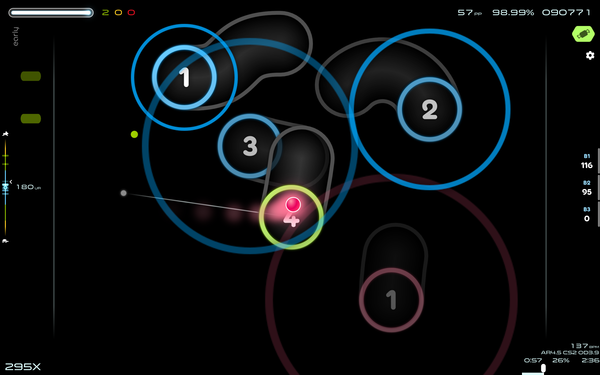

# osu-skin-KaKKeY
KaKKeY is a STD osu!lazer skin originated by fuyukiS' uncompleted rhythm game project KaKKeY.

Hitsounds are from [`Moonshine 2.1`](https://osu.ppy.sh/community/forums/topics/1610388?n=1) by [`moonstaar`](https://osu.ppy.sh/users/27339355) (not within the repository, only in releases). Images are drawn by fuyukiS with Inkscape.

## Screenshots
Shot with 'Gameplay cursor size' 64%, 'Adjust gameplay cursor size based on current beatmap' on

background\

default (no mod)\
\

HD\

EZ\
\
EZ dot\

HR\

DT: Rafis HDDT

FL\

TC\
\
TC2: glowing approach circle\
TC2s: glowing approach circle, single color\
TC2d: glowing approach circle, different colors for appr. circle & slider border\

## Build
Install Inkscape (>=`Inkscape 1.2.2 (b0a8486541, 2022-12-01)`) and run `source/export-all.sh`, and run every `source/**/make*.sh`, and pack corresponding `png` files (for the defaults (no mod), pack in every `**/default/*.png` and `.png` within folders that doesn't contain `default` subfolder) into a `zip` file and change its suffix to `.osk`.

------

## Previous versions

Since version 2025.04.27, folder `Extras` are no longer provided. Check `sources/` in this repo for old layout, alternative elements etc.

#### 2024.07.27

#### fuyukiS' presets NM:

#### Other mods:

#### 2024.06.01
See folder `Extras/UI/new-with-song-info-but-without-rank-display` for this UI config.

#### 2024.04.27
See every subfolder named `classic` in folder `Extras` for these configs.

