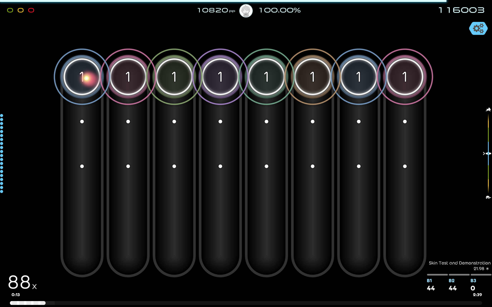

# osu-skin-KaKKeY
KaKKeY is a STD osu!lazer skin originated by fuyukiS' uncompleted rhythm game project KaKKeY.

Hitsounds and `followpoint*` are from [`Moonshine 2.1`](https://osu.ppy.sh/community/forums/topics/1610388?n=1). Everything else are drawn by fuyukiS with Inkscape.

The sources SVG files are not ready yet, so this repo is basically empty. Check out Releases for download.

Screenshots:

